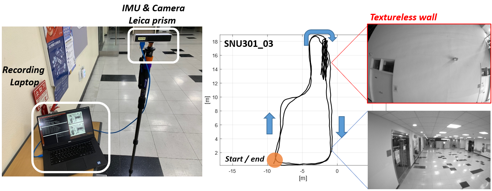

# Ensemble Visual-Inertial Odometry (EnVIO)

**Authors : [Jae Hyung Jung](https://sites.google.com/view/lastflowers), Yeongkwon Choe, and Chan Gook Park**

### 1. Overview

This is a ROS package of Ensemble Visual-Inertial Odometry (EnVIO) written in C++. It features a photometric (*direct*) measurement model and stochastic linearization that are implemented by iterated extended Kalman filter fully built on the matrix Lie group. EnVIO takes time-synced stereo images and IMU readings as input and outputs the current vehicle pose and feature depths at the current camera frame with their estimated uncertainties.

[](https://www.youtube.com/watch?v=dv1tnvR3kVs&t=0s)


### 2. Build

* This package was tested on **Ubuntu 16.04 (ROS Kinetic)** with **Eigen 3.3.7** for matrix computation and **OpenCV 3.3.1** for image processing in **C++11**.
* There are no additional dependencies, we hope this package can be built without any difficulties in different environments.
* We use the catkin build system :

```
cd catkin_ws
catkin_make
```


### 3. Run ([EuRoC](https://projects.asl.ethz.ch/datasets/doku.php?id=kmavvisualinertialdatasets) example)

* Configuration and launch files are prepared in `config/euroc/camchain-imucam-euroc.yaml`  and `launch/nesl_envio_euroc.launch`.
* The configuration files are output by [Kalibr](https://github.com/ethz-asl/kalibr) toolbox.
* Filter and image processing parameters are set from the launch file.
* **Please note that our filter implementation requires static state at the beginning to initialize tilt angles, velocity and gyroscope biases.** The temporal window for this process can be set by `num_init_samples` in the launch file.
* As default our package outputs `est_out.txt` that includes estimated states.

```
roslaunch ensemble_vio nesl_envio_euroc.launch
roslaunch ensemble_vio nesl_envio_rviz.launch
rosbag play rosbag.bag
```

[](https://www.youtube.com/watch?v=VLonFPfE7HI&t=0s)


### 4. Hand-held dataset with textureless wall

* We recorded stereo images & IMU readings, and high precision position reference by using [MYNTEYE S1030](https://www.mynteye.com/products/mynt-eye-stereo-camera) and [Leica TS-16](https://leica-geosystems.com/products/total-stations/robotic-total-stations/leica-ts16), respectively in BLDG. 301 at our campus, SNU. It features the textureless white wall during the course.



* Trajectory information is summarized as below

  | Sequence num. | Length [m] | Duration [sec] | White wall ? |
  | :-----------: | :--------: | :------------: | :----------: |
  |   snu301_00   |     89     |      105       |      X       |
  |   snu301_01   |    117     |      143       |      O       |
  |   snu301_02   |    147     |      182       |      O       |
  |   snu301_03   |    159     |      199       |      O       |


* You can download our dataset [here](https://drive.google.com/file/d/11X1ETEZgj6vwW5flIsfm8rzRu4yatScf/view?usp=sharing). (6.2 GB)

* Please use `nesl_envio_mynt.launch` to test the dataset :

  ```
  roslaunch ensemble_vio nesl_envio_mynt.launch
  roslaunch ensemble_vio nesl_envio_rviz.launch
  rosbag play snu301_xx.bag
  ```

[](https://www.youtube.com/watch?v=o3otmHp1Wis&t=0s)


### 5. Run your own device

* Our implementation assumes that stereo camera is hardware-synced and the spatio-temporal parameters for cameras and IMU are calibrated as it is a critical step in sensor fusion.
* You can calibrate your visual-inertial sensor using [Kalibr](https://github.com/ethz-asl/kalibr) toolbox and place the output file in `config`.
* The input ROS topics and filter parameters are set in `launch`.
* With low cost IMUs as in EuRoC sensor suite, you can use the default parameters of EuRoC example file. 


### 6. Citation

If you feel this work helpful to your academic research, we kindly ask you to cite our paper :

```
@article{EnVIO_TRO,
  title={Photometric Visual-Inertial Navigation with Uncertainty-Aware Ensembles},
  author={Jung, Jae Hyung and Choe, Yeongkwon and Park, Chan Gook},
  journal={IEEE Transactions on Robotics},
  year={2022},
  publisher={IEEE}
}
```


### 7. Acknowledgements

This research was supported in part by Unmanned Vehicle Advanced Research Center funded by the Ministry of Science and ICT, the Republic of Korea and in part by Hyundai NGV Company.


### 8. License

Our source code is released under [GPLv3](https://www.gnu.org/licenses/gpl-3.0.en.html) license. If there are any issues in our source code please contact to the author (lastflowers@snu.ac.kr).


